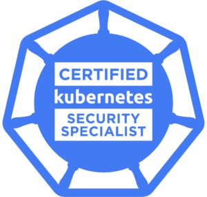

[](https://creativecommons.org/licenses/by-sa/4.0/)
[](http://makeapullrequest.com)
# Certified Kubernetes Security Specialist - CKS

<p align="center">
  
</p>

Online curated resources that will help you prepare for taking the Kubernetes Certified Kubernetes Security Specialist **CKS** Certification exam.

- Please raise an issue, or make a pull request for fixes, new additions, or updates.

Resources are primarly cross referenced back to the [allowed CKS sites](#urls-allowed-in-the-extra-single-tab) during the exam as per CNCF/Linux Foundation exam allowed search rules. Videos and other third party resources e.g. blogs will be provided as an optional complimentary material and any 3rd party material not allowed in the exam will be designated with :triangular_flag_on_post: in the curriculum sections below.

Ensure you have the right version of Kubernetes documentation selected (e.g. v1.23 as of 3rd March 2022) especially for API objects and annotations, however for third party tools, you might find that you can still find references for them in old releases and blogs [e.g. Falco install](https://github.com/kubernetes/website/issues/24184).

* Icons/emoji legend
  - :clipboard:  Expand to see more content
  - :confused:   Verify, not best resource yet
  - :large_blue_circle: Good overall refence, can be used in the exam
  - :triangular_flag_on_post: External third-party resource, can not be used during exam
  - :pencil:  To-do, item that needs further checking(todo list for future research/commits)

## Exam Brief

Offical exam objectives you review and understand in order to pass the test.

* [CNCF Exam Curriculum repository ](https://github.com/cncf/curriculum/)

- Duration : two (2) hours
- Number of questions: 15-20 hands-on performance based tasks
- Passing score: 67%
- Certification validity: two (2) years
- Prerequisite: valid CKA
- Cost: $375 USD, One (1) year exam eligibility, with a free retake within the year.

  *Linux Foundation offer several discounts around the year e.g. CyberMonday, Kubecon attendees among other special holidays/events*

### URLs allowed in the extra single tab
  - From Chrome or Chromium browser to open one additional tab in order to access
    Kubernetes Documentation:
    - https://kubernetes.io/docs and their subdomains
    - https://github.com/kubernetes and their subdomains
    - https://kubernetes.io/blog and their subdomains

  This includes all available language translations of these pages (e.g. https://kubernetes.io/zh/docs)
  - Tools:
    - [Trivy documentation](https://github.com/aquasecurity/trivy)
    - [Sysdig documentation](https://docs.sysdig.com)
    - [Falco documentation](https://falco.org/docs)
    - [App Armor documentation](https://gitlab.com/apparmor/apparmor/-/wikis/Documentation)

## CKS repo topics overview

  - [X] [Cluster Setup - 10%](#cluster-setup---10)
  - [X] [Cluster Hardening - 15%](#cluster-hardening---15)
  - [X] [System Hardening - 15%](#system-hardening---15)
  - [X] [Minimize Microservice Vulnerabilities - 20%](#minimize-microservice-vulnerabilities---20)
  - [X] [Supply Chain Security - 20%](#supply-chain-security---20)
  - [X] [Monitoring, Logging and Runtime Security - 20%](#monitoring-logging-and-runtime-security---20)

  #### Extra helpful material

  - [x] [Slack](#slack)
  - [x] [Books](#books)
  - [x] [Youtube Videos](#youtube-videos)
  - [x] [Webinars](#webinars)
  - [x] [Containers and Kubernetes Security Training](#containers-and-kubernetes-security-training)
  - [x] [Extra Kubernetes security resources](generic-kubernetes-containers-security/Kubernetes.md)

<hr style="border:3px solid blue"> </hr>

### Cluster Setup - 10%
:large_blue_circle: [Securing a Cluster](https://kubernetes.io/docs/tasks/administer-cluster/securing-a-cluster/)

1. [Use Network security policies to restrict cluster level access](https://kubernetes.io/docs/concepts/services-networking/network-policies/)
2. :triangular_flag_on_post: [Use CIS benchmark to review the security configuration of Kubernetes components](https://www.cisecurity.org/benchmark/kubernetes/)  (etcd, kubelet, kubedns, kubeapi)
    - :triangular_flag_on_post: [Kube-bench](https://github.com/aquasecurity/kube-bench) - Checks whether Kubernetes is deployed securely by running the checks documented ain the CIS Kubernetes Benchmark.
3. Properly set up [Ingress objects with security control](https://kubernetes.io/docs/concepts/services-networking/ingress/#tls)
4. [Protect node metadata and endpoints](https://kubernetes.io/docs/tasks/administer-cluster/securing-a-cluster/#restricting-cloud-metadata-api-access)

    <details><summary> Using Kubernetes network policy to restrict pods access to cloud metadata </summary>

      * This example assumes AWS cloud, and metadata IP address is 169.254.169.254 should be blocked while all other external addresses are not.

      ```yaml
      apiVersion: networking.k8s.io/v1
      kind: NetworkPolicy
      metadata:
        name: deny-only-cloud-metadata-access
      spec:
        podSelector: {}
        policyTypes:
        - Egress
        egress:
        - to:
          - ipBlock:
            cidr: 0.0.0.0/0
            except:
            - 169.254.169.254/32
      ```
    </details>

5. [Minimize use of, and access to, GUI elements](https://kubernetes.io/docs/tasks/access-application-cluster/web-ui-dashboard/#accessing-the-dashboard-ui)
6. [Verify platform binaries before deploying](https://github.com/kubernetes/kubernetes/releases)

     <details><summary> :clipboard:  Kubernetes binaries can be verified by their digest **sha512 hash**  </summary>

     - Checking the Kubernetes release page for the specific release
     - Checking the change log for the [images and their digests](https://github.com/kubernetes/kubernetes/blob/master/CHANGELOG/CHANGELOG-1.19.md#downloads-for-v1191)

     </details>


### Cluster Hardening - 15%

1. [Restrict access to Kubernetes API](https://kubernetes.io/docs/reference/access-authn-authz/controlling-access/)
  - [Control anonymous requests to Kube-apiserver](https://kubernetes.io/docs/reference/access-authn-authz/authentication/#anonymous-requests)
  - [Non secure access to the kube-apiserver](https://kubernetes.io/docs/concepts/security/controlling-access/#api-server-ports-and-ips)
2. [Use Role-Based Access Controls to minimize exposure](https://kubernetes.io/docs/reference/access-authn-authz/rbac/)
    * :triangular_flag_on_post: [Handy site collects together articles, tools and the official documentation all in one place](https://rbac.dev/)
    * :triangular_flag_on_post: [Simplify Kubernetes Resource Access Control using RBAC Impersonation](https://docs.bitnami.com/tutorials/simplify-kubernetes-resource-access-rbac-impersonation/)
3. Exercise caution in using service accounts e.g. [disable defaults](https://kubernetes.io/docs/tasks/configure-pod-container/configure-service-account/#use-the-default-service-account-to-access-the-api-server), minimize permissions on newly created ones

   <details><summary> :clipboard: Opt out of automounting API credentials for a service account </summary>

   #### Opt out at service account scope
   ```yaml
   apiVersion: v1
   kind: ServiceAccount
   metadata:
     name: build-robot
   automountServiceAccountToken: false
   ```
   #### Opt out at pod scope
   ```yaml
   apiVersion: v1
   kind: Pod
   metadata:
     name: cks-pod
   spec:
     serviceAccountName: default
     automountServiceAccountToken: false
   ```

   </details>


4. [Update Kubernetes frequently](https://kubernetes.io/docs/reference/setup-tools/kubeadm/kubeadm-upgrade/)

### System Hardening - 15%

1. Minimize host OS footprint (reduce attack surface)

   <details><summary> :clipboard: :confused: Reduce host attack surface </summary>

   * [seccomp which stands for secure computing was originally intended as a means of safely running untrusted compute-bound programs](https://kubernetes.io/docs/tutorials/clusters/seccomp/)
   * [AppArmor can be configured for any application to reduce its potential host attack surface and provide greater in-depth defense.](https://kubernetes.io/docs/tutorials/clusters/apparmor/)
   * [PSP enforces](https://kubernetes.io/docs/concepts/policy/pod-security-policy/)
   * Apply host updates
   * Install minimal required OS fingerprint
   * Identify and address open ports
   * Remove unnecessary packages
   * Protect access to data with permissions
     *  [Restirct allowed hostpaths](https://kubernetes.io/docs/concepts/policy/pod-security-policy/#volumes-and-file-systems)

   </details>

2. Minimize IAM roles
   * :confused: [Access authentication and authorization](https://kubernetes.io/docs/reference/access-authn-authz/authentication/)
3. Minimize external access to the network

   <details><summary> :clipboard: :confused: if it means deny external traffic to outside the cluster?!! </summary>

   * not tested, however, the thinking is that all pods can talk to all pods in all name spaces but not to the outside of the cluster!!!

   ```yaml
   apiVersion: networking.k8s.io/v1
   kind: NetworkPolicy
   metadata:
     name: deny-external-egress
   spec:
     podSelector: {}
     policyTypes:
     - Egress
     egress:
       to:
       - namespaceSelector: {}
     ```

    </details>

4. Appropriately use kernel hardening tools such as AppArmor, seccomp
   * [AppArmor](https://kubernetes.io/docs/tutorials/clusters/apparmor/)
   * [Seccomp](https://kubernetes.io/docs/tutorials/clusters/seccomp/)

### Minimize Microservice Vulnerabilities - 20%

1. Setup appropriate OS-level security domains e.g. using PSP, OPA, security contexts
   - [Pod Security Policies](https://kubernetes.io/docs/concepts/policy/pod-security-policy/)
   - [Open Policy Agent](https://kubernetes.io/blog/2019/08/06/opa-gatekeeper-policy-and-governance-for-kubernetes/)
   - [Security Contexts](https://kubernetes.io/docs/tasks/configure-pod-container/security-context/)
2. [Manage kubernetes secrets](https://kubernetes.io/docs/concepts/configuration/secret/)
3. Use [container runtime](https://kubernetes.io/docs/concepts/containers/runtime-class/) sandboxes in multi-tenant environments (e.g. [gvisor, kata containers](https://github.com/kubernetes/enhancements/blob/5dcf841b85f49aa8290529f1957ab8bc33f8b855/keps/sig-node/585-runtime-class/README.md#examples))
4. [Implement pod to pod encryption by use of mTLS](https://kubernetes.io/docs/tasks/tls/managing-tls-in-a-cluster/)
  - [ ] :pencil: check if service mesh is part of the CKS exam

### Supply Chain Security - 20%

1. Minimize base image footprint

   <details><summary> :clipboard: Minimize base Image </summary>

   * Use distroless, UBI minimal, Alpine, or relavent to your app nodejs, python but the minimal build.
   * Do not include uncessary software not required for container during runtime e.g build tools and utilities, troubleshooting and debug binaries.
     * :triangular_flag_on_post: [Learnk8s: 3 simple tricks for smaller Docker images](https://learnk8s.io/blog/smaller-docker-images)
      * :triangular_flag_on_post: [GKE 7 best practices for building containers](https://cloud.google.com/blog/products/gcp/7-best-practices-for-building-containers)

   </details>

2. Secure your supply chain: [whitelist allowed image registries](https://kubernetes.io/blog/2019/03/21/a-guide-to-kubernetes-admission-controllers/#why-do-i-need-admission-controllers), sign and validate images
  * Using [ImagePolicyWebhook admission Controller](https://kubernetes.io/docs/reference/access-authn-authz/admission-controllers/#imagepolicywebhook)
4. Use static analysis of user workloads (e.g. [kubernetes resources](https://kubernetes.io/blog/2018/07/18/11-ways-not-to-get-hacked/#7-statically-analyse-yaml), docker files)
5. [Scan images for known vulnerabilities](https://kubernetes.io/blog/2018/07/18/11-ways-not-to-get-hacked/#10-scan-images-and-run-ids)
    * [Aqua security Trivy]( https://github.com/aquasecurity/trivy)
    * :triangular_flag_on_post: [Anchore command line scans](https://github.com/anchore/anchore-cli#command-line-examples)
### Monitoring, Logging and Runtime Security - 20%

1. Perform behavioural analytics of syscall process and file activities at the host and container level to detect malicious activities
	- [Falco installation guide](https://falco.org/docs/)
	- :triangular_flag_on_post: [Sysdig Falco 101](https://learn.sysdig.com/falco-101)
	- :triangular_flag_on_post: [Falco Helm Chart](https://github.com/falcosecurity/charts/tree/master/falco)
	- :triangular_flag_on_post: [Falco Kubernetes helmchart](https://github.com/falcosecurity/charts)
	- :triangular_flag_on_post: [Detect CVE-2020-8557 using Falco](https://falco.org/blog/detect-cve-2020-8557/)
2. Detect threats within a physical infrastructure, apps, networks, data, users and workloads
3. Detect all phases of attack regardless where it occurs and how it spreads

   <details><summary> :clipboard:  Attack Phases </summary>

     - :triangular_flag_on_post: [Kubernetes attack martix Microsoft blog](https://www.microsoft.com/security/blog/2020/04/02/attack-matrix-kubernetes/)
     - :triangular_flag_on_post: [MITRE attack framwork using Falco](https://sysdig.com/blog/mitre-attck-framework-for-container-runtime-security-with-sysdig-falco/)
     - :triangular_flag_on_post: [Lightboard video: Kubernetes attack matrix - 3 steps to mitigating the MITRE ATT&CK Techniques]()
     - :triangular_flag_on_post: [CNCF Webinar: Mitigating Kubernetes attacks](https://www.cncf.io/webinars/mitigating-kubernetes-attacks/)

   </details>

4. Perform deep analytical investigation and identification of bad actors within the environment
   - [Sysdig documentation](https://docs.sysdig.com/)
   - [Monitoring Kubernetes with sysdig](https://kubernetes.io/blog/2015/11/monitoring-kubernetes-with-sysdig/)
   - :triangular_flag_on_post: [CNCF Webinar: Getting started with container runtime security using Falco](https://youtu.be/VEFaGjfjfyc)
5. [Ensure immutability of containers at runtime](https://kubernetes.io/blog/2018/03/principles-of-container-app-design/)
6. [Use Audit Logs to monitor access](https://kubernetes.io/docs/tasks/debug-application-cluster/audit/)

<hr style="border:3px solid blue"> </hr>

## Extra helpful material

### Slack

1. [Kubernetes Community - #cks-exam-prep](https://kubernetes.slack.com)
1. [Kubernauts Community - #cks](https://kubernauts-slack-join.herokuapp.com/)
2. [Saiyam's Pathak OpenSource Discord #CKS channel](https://discord.gg/9PQBYKntPR)


### Twitch

1. [KubeNativeSecurity twitch stream Talk Shows & Podcasts](https://www.twitch.tv/kubenativesecurity)

### Books

1. [Aqua Security Liz Rice:Free Container Security Book](https://info.aquasec.com/container-security-book)
1. [Learn Kubernetes security: Securely orchestrate, scale, and manage your microservices in Kubernetes deployments](https://www.amazon.com/Learn-Kubernetes-Security-orchestrate-microservices/dp/1839216506)
1. [Let's Learn CKS Scenarios](https://gumroad.com/l/cksbook)

### Youtube Videos

1. [Google/Ian Lewis: Kubernetes security best practices](https://youtu.be/wqsUfvRyYpw)
1. [Code in Action for the **book Learn Kubernetes Security** playlist](https://www.youtube.com/playlist?list=PLeLcvrwLe1859Rje9gHrD1KEp4y5OXApB)
1. [Kubernetes security concepts and demos](https://youtu.be/VjlvS-qiz_U)

### Containers and Kubernetes Security Training

1. [Killer.sh CKS practice exam](https://killer.sh/cks) - use code **walidshaari** for **20%** discount.
1. UDEMY Kim Wüstkamp's [Kubernetes CKS 2021 Complete Course with killer.sh Simulator **(discounted price)**](https://killer.sh/r?d=cks-course)
1. [Linux Foundation Kubernetes Security essentials LFS 260](https://training.linuxfoundation.org/training/kubernetes-security-essentials-lfs260/)
2. [Mumshad's KodeCloud "Certified Kubernetes Security Specialist" CKS and training and labs](https://kodekloud.com/p/certified-kubernetes-security-specialist-cks)
3. [Linux Academy/ACloudGuru Kubernetes security](https://acloud.guru/learn/7d2c29e7-cdb2-4f44-8744-06332f47040e)
4. Zeal Vora's Udemy [ Certified Kubernetes Security Specialist 2021 ](https://www.udemy.com/course/certified-kubernetes-security-specialist-certification/?referralCode=F38A7E4C09BFEC7E3C58) - Link includes a discount till 28th January 2021
5. [Cloud native security defending containers and kubernetes](https://www.sans.org/event/stay-sharp-blue-team-ops-and-cloud-dec-2020/course/cloud-native-security-defending-containers-kubernetes)
6. [Tutorial: Getting Started With Cloud-Native Security - Liz Rice, Aqua Security & Michael Hausenblas](https://youtu.be/MisS3wSds40)
    - [Hands-on Tutorial](https://tutorial.kubernetes-security.info/)
7. [K21 academy CKS step by step activity hands-on-lab activity guide](https://k21academy.com/docker-kubernetes/certified-kubernetes-security-specialist-cks-step-by-step-activity-guide-hands-on-lab)
8. [Andrew Martin Control Plane Security training](https://control-plane.io/training/)
9. [Free Exam simulators from killer.sh available with CKS certification from Linux Foundation](https://training.linuxfoundation.org/announcements/linux-foundation-kubernetes-certifications-now-include-exam-simulator/)
10. [Sysdig Falco 101](https://learn.sysdig.com/falco-101)
11. [Killercoda in-browser CKS Playground and Challenges](https://killercoda.com/killer-shell-cks) - FREE

#### Other CKS related repos

1. [Stackrox CKS study guide](https://github.com/stackrox/Kubernetes_Security_Specialist_Study_Guide) - Brief and informative study guide from [Stackrox @mfosterrox](https://www.stackrox.com/authors/mfoster/)
2. [Kim's CKS Challenge series](https://github.com/killer-sh/cks-challenge-series) - also posted on medium @ https://wuestkamp.medium.com/
3. [Abdennour](https://github.com/abdennour/certified-kubernetes-security-specialist)
4. [Ibrahim Jelliti](https://github.com/ijelliti/CKSS-Certified-Kubernetes-Security-Specialist)
5. [Viktor Vedmich](https://github.com/vedmichv/CKS-Certified-Kubernetes-Security-Specialist)
6. [Kubernetes Security Checklist and Requirements](https://github.com/Vinum-Security/kubernetes-security-checklist)
7. [CKS Exam series](https://github.com/moabukar/CKS-Exercises-Certified-Kubernetes-Security-Specialist.git)
